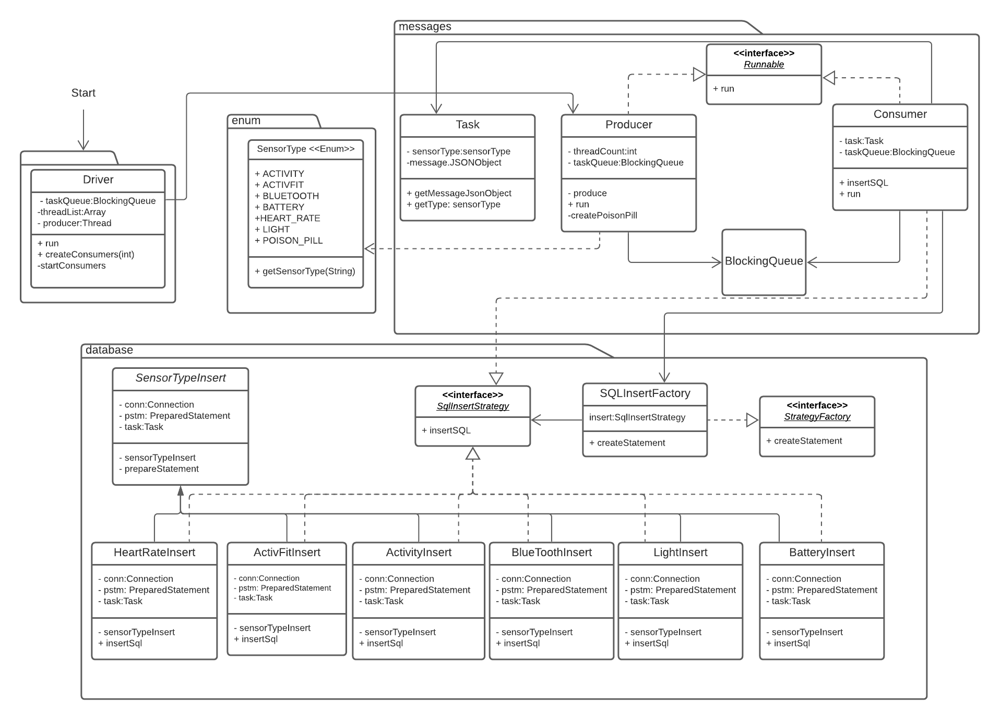

# Producer Consumer Database Insert 

This program uses a producer and consumer framework to insert json data into different Mysql tables
The json data is sensor data collected from a smart watch for sensor types such as
activity, activfit, battery, lightsensor, heartrate, and bluetooth. Each sensor type is its own sql table.

The program works as follows: A producer class implements Runnable. Reads the input file, line by line. 
For each json object, the producer reads the sensor type. The producer creates a Task object and assigns the
SensorType Enum based on the sensor type in the json. The json object is passed in into the task as well.
The producer puts the Task into a BlockingQueue. Once all the records are read,
the Producer creates a poison pill task for each Consumer running and puts it into the queue.

The Consumer objects implements Runnable. It removes a Task from the Object Queue.
The SensorType object in the Task path is used to determine which insert statement strategy
to use. The SqlInsertFactory method is used to pick the correct strategy (LightInsert, ActivFitInsert, ActivitInsert,
BluetoothInsert, HeartRateInsert)

The consumer executes the InsertSql strategy and commits the results to the database.
If the Consumer pulls a Poison Pill, the thread shuts down.

The Driver class uses the Facade design pattern to tie together all the business
logic. The Driver class initializes Producer and Consumers. A parameter
passed in the main class determines how many Consumer threads to create

## UML Diagram

